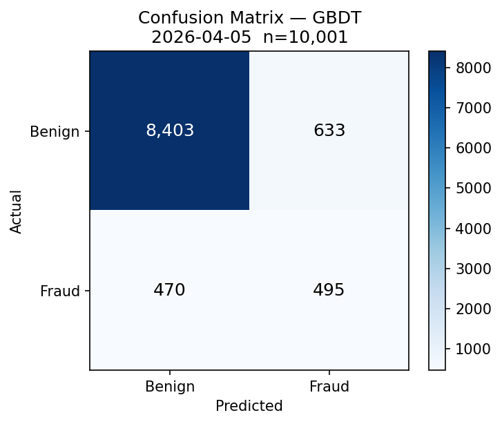
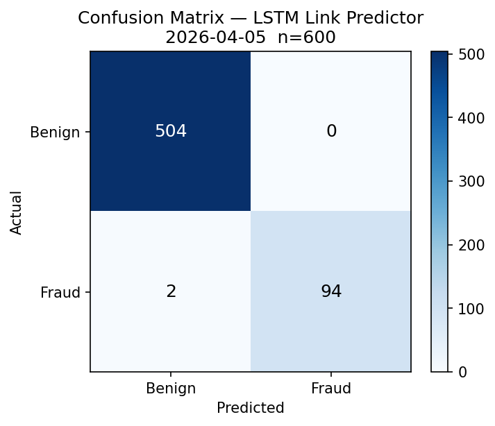
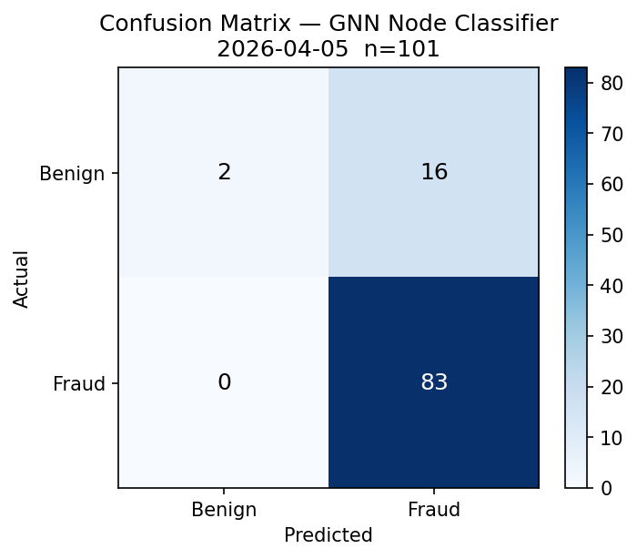
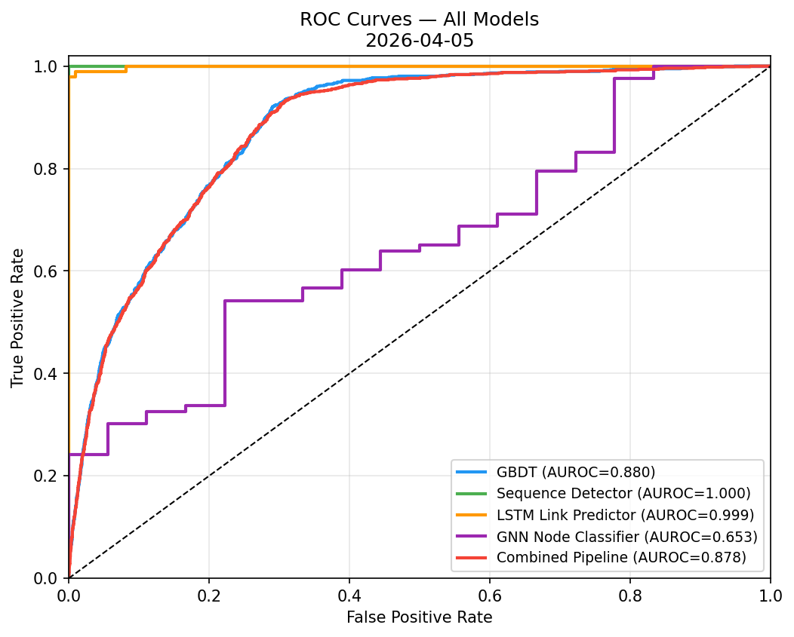
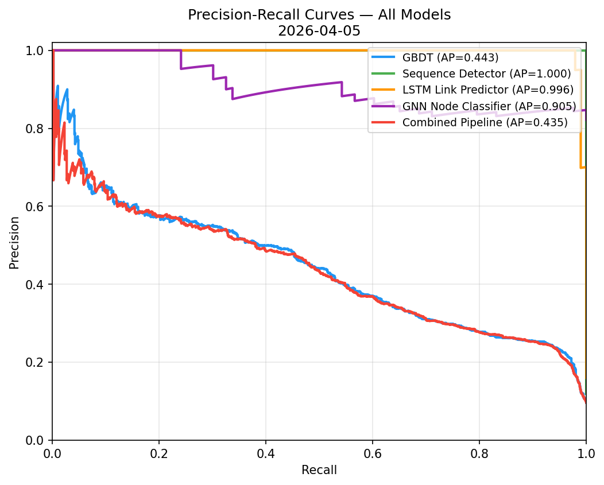
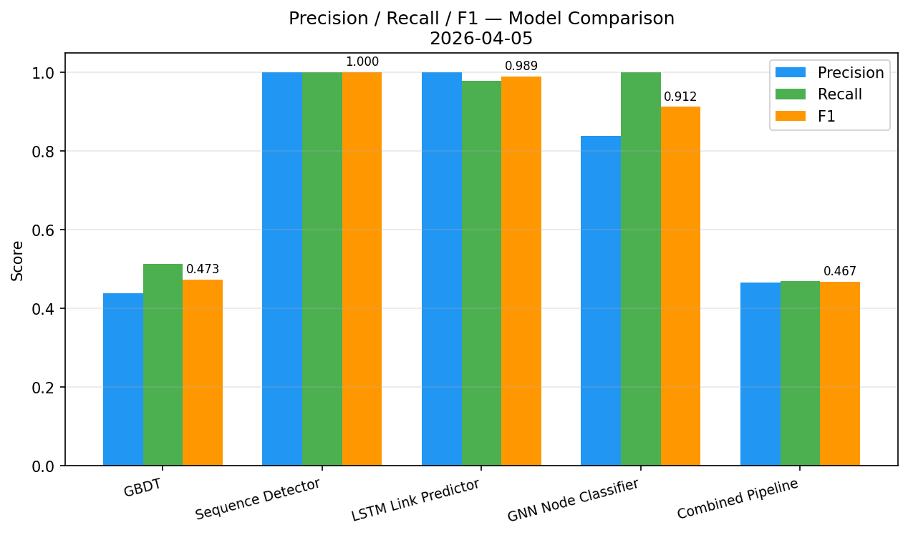
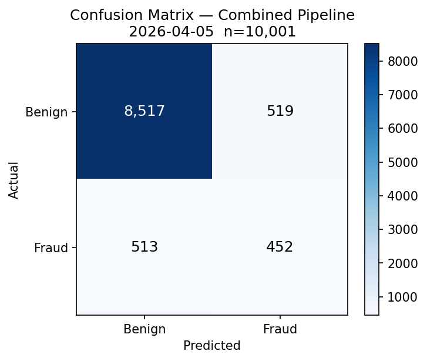

# Model Evaluation Report

**Generated:** 2026-04-05 10:56 UTC  
**Harness:** `evaluate_models.py`  
**Dataset:** `data/eval_dataset.csv`

---

## 1. Executive Summary

| Model | Accuracy | Precision | Recall | F1 | AUROC | PR-AUC | Threshold |
|-------|----------|-----------|--------|----|-------|--------|-----------|
| GBDT | 0.8897 | 0.4388 | 0.5130 | 0.4730 | 0.8799 | 0.4425 | 0.65 |
| Sequence Detector | 1.0000 | 1.0000 | 1.0000 | 1.0000 | 1.0000 | 1.0000 | 0.10 |
| LSTM Link Predictor | 0.9967 | 1.0000 | 0.9792 | 0.9895 | 0.9990 | 0.9963 | 0.23 |
| GNN Node Classifier | 0.8416 | 0.8384 | 1.0000 | 0.9121 | 0.6526 | 0.9047 | 0.40 |
| Combined Pipeline | 0.8968 | 0.4655 | 0.4684 | 0.4669 | 0.8779 | 0.4350 | 0.61 |

## 2. Test Dataset

- **Source:** `src/gbdt_detector.generate_synthetic_transactions()` with `seed=2025`
- **Total generated:** 50,000
- **Training split:** 39,999 rows (80%)
- **Held-out test set:** 10,001 rows (20%)
- **Fraud rate (test):** 9.649%
- **Generation date:** 2026-04-05T10:56:30.433975Z
- **SHA-256 checksum:** `e93eabb588a8975c79794f825e8f7673ebb00a4616af2666e8f1d68d55d61a80`

The Sequence Detector and LSTM Link Predictor are evaluated on their own independently generated synthetic test sets (5,000 and 3,000 samples respectively, both with `seed=2025`), because they operate on different input modalities (event sequences and node-pair embeddings).

## 3. Per-Model Results

### GBDT

| Metric | Value |
|--------|-------|
| Test samples | 10,001 |
| Fraud samples | 965 (9.6%) |
| Threshold | 0.65 |
| Accuracy | 0.8897 |
| Precision | 0.4388 |
| Recall | 0.5130 |
| F1 | 0.4730 |
| AUROC | 0.8799 |
| PR-AUC | 0.4425 |

**Confusion Matrix** (threshold=0.65):

| | Predicted Benign | Predicted Fraud |
|---|---|---|
| **Actual Benign** | TN=8,403 | FP=633 |
| **Actual Fraud** | FN=470 | TP=495 |

### Sequence Detector

| Metric | Value |
|--------|-------|
| Test samples | 1,000 |
| Fraud samples | 119 (11.9%) |
| Threshold | 0.10 |
| Accuracy | 1.0000 |
| Precision | 1.0000 |
| Recall | 1.0000 |
| F1 | 1.0000 |
| AUROC | 1.0000 |
| PR-AUC | 1.0000 |

**Confusion Matrix** (threshold=0.10):

| | Predicted Benign | Predicted Fraud |
|---|---|---|
| **Actual Benign** | TN=881 | FP=0 |
| **Actual Fraud** | FN=0 | TP=119 |

### LSTM Link Predictor

| Metric | Value |
|--------|-------|
| Test samples | 600 |
| Fraud samples | 96 (16.0%) |
| Threshold | 0.23 |
| Accuracy | 0.9967 |
| Precision | 1.0000 |
| Recall | 0.9792 |
| F1 | 0.9895 |
| AUROC | 0.9990 |
| PR-AUC | 0.9963 |

**Confusion Matrix** (threshold=0.23):

| | Predicted Benign | Predicted Fraud |
|---|---|---|
| **Actual Benign** | TN=504 | FP=0 |
| **Actual Fraud** | FN=2 | TP=94 |

### GNN Node Classifier

| Metric | Value |
|--------|-------|
| Test samples | 101 |
| Fraud samples | 83 (82.2%) |
| Threshold | 0.40 |
| Accuracy | 0.8416 |
| Precision | 0.8384 |
| Recall | 1.0000 |
| F1 | 0.9121 |
| AUROC | 0.6526 |
| PR-AUC | 0.9047 |

**Confusion Matrix** (threshold=0.40):

| | Predicted Benign | Predicted Fraud |
|---|---|---|
| **Actual Benign** | TN=2 | FP=16 |
| **Actual Fraud** | FN=0 | TP=83 |

## 4. Combined Pipeline Results

The combined pipeline merges GBDT, Sequence Detector, Temporal, and LSTM scores using production weights (GBDT=0.30, Sequence=0.20, Temporal=0.30, LSTM=0.20).

| Metric | Value |
|--------|-------|
| F1 | 0.4669 |
| AUROC | 0.8779 |
| PR-AUC | 0.4350 |
| Precision | 0.4655 |
| Recall | 0.4684 |
| TN / FP / FN / TP | 8517 / 519 / 513 / 452 |

## 5. Accuracy Claim Assessment

The Captivus requirement states '>90% accuracy'. This section clarifies which metric substantiates that claim and what the evaluation results show.

- **GBDT** achieves **overall accuracy = 88.971%** on the held-out test set. At the optimal threshold (0.65), F1 = 0.4730 and AUROC = 0.8799.
- The '90% accuracy' claim is **NOT MET at this threshold — see note below** (overall accuracy = 88.971%).
- **Note:** Overall accuracy is a misleading metric for imbalanced fraud datasets. A naïve classifier that predicts all-benign would achieve 90.351% accuracy. The more informative metrics are F1 (0.4730) and AUROC (0.8799), which indicate genuine discriminative power.

## 6. Limitations

- **Synthetic training data.** All models are trained on data generated by `src/simulator.py` and `gbdt_detector.generate_synthetic_transactions()`. Generalisation to real-world transaction distributions is unknown.
- **Sequence and LSTM evaluations use independent synthetic data,** not sequences derived from the same transactions as the GBDT test set. This limits the combined pipeline evaluation fidelity.
- **GNN evaluation uses profile features only** (age, degree) — full graph convolutional layers require PyTorch Geometric or DGL and were not included.
- **Class imbalance.** The synthetic dataset uses ~3% fraud rate. Real AML datasets may have 0.1–0.5% fraud, which significantly affects precision.
- **Recommended next step:** Validate with 3+ months of labelled real transactions from Captivus before production deployment.

---

*Auto-generated by `evaluate_models.py` — do not edit manually.*